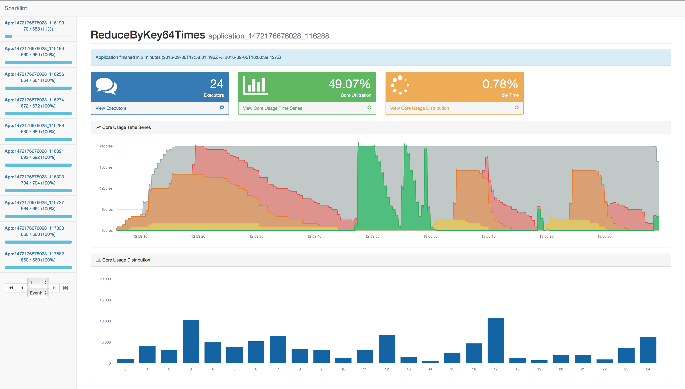

Sparklint
========

The missing Spark Performance Debugger that can be drag and dropped into your spark application!

> Featured in Spark Summit 2016 EU: [Introduction](https://spark-summit.org/eu-2016/events/sparklint-a-tool-for-monitoring-identifying-and-tuning-inefficient-spark-jobs-across-your-cluster/) | [Slides](https://www.slideshare.net/SparkSummit/spark-summit-eu-talk-by-simon-whitear) | [Video](https://www.youtube.com/watch?v=reGerTzcvoA)    
Upcoming related talk at Spark Summit 2017 SF: [Introduction](https://spark-summit.org/2017/events/continuous-application-with-fair-scheduler/) | [Slides](https://www.slideshare.net/databricks/continuous-application-with-fair-scheduler-with-robert-xue) | [Video](https://youtu.be/oXwOQKXo9VE)

### Mission
- Provide advance metrics and better visualization about your spark application's resource utilization
  - Vital application life time stats like idle time, average vcore usage, distribution of locality
  - View task allocation by executor
  - VCore usage graphs by FAIR scheduler group
  - VCore usage graphs by task locality
  - (WIP) Find rdds that can benefit from persisting
- Help you find out where the bottle neck are
  - (WIP) Automated report on application bottle neck
- (WIP) Opportunity to give the running application real-time hints on magic numbers like partitions size, job submission parallelism, whether to persist rdd or not



### Usage

First figure out your current spark version. Please refer to `project/BuildUtils.scala` and look for `SUPPORTED_SPARK_VERSIONS`, these are the versions that we support out of box.

If your spark version has our precompiled sparklint jar (let's say 1.6.1 on scala 2.10), the jar name will be `sparklint-spark161_2.10`.
Please note, in the jar the `161` means `Spark1.6.1` and `2.10` means `scala 2.10`

If your spark version is not precompiled (i.e. 1.5.0), you can add an entry in `project/BuildUtils.getSparkMajorVersion`, then provide compatible code similar to spark-1.6 in `src/main/spark-1.5`

For more detail about event logging, how to enable it, and how to gather log files, check http://spark.apache.org/docs/latest/configuration.html#spark-ui

##### Live mode (run inside spark driver node)

SparklintListener is an implementation of [SparkFirehoseListener](https://spark.apache.org/docs/1.5.2/api/java/org/apache/spark/SparkFirehoseListener.html)
that listen to spark event log while the application is running. To enable it, you can try one of the following:

1. Upload packaged jar to your cluster, include jar in classpath directly
2. Use `--packages` command to inject dependency during job submission if we have a precompiled jar, like `--conf spark.extraListeners=com.groupon.sparklint.SparklintListener --packages com.groupon.sparklint:sparklint-spark201_2.11:1.0.8`
3. Add dependency directly in your pom, repackage your application, then during job submission, use `--conf spark.extraListeners=com.groupon.sparklint.SparklintListener`

Finally, find out your spark application's driver node address, open a browser and visit port 23763 (our default port) of the driver node.

> Add dependency directly for pom.xml
  ```
  <dependency>
      <groupId>com.groupon.sparklint</groupId>
      <artifactId>sparklint-spark201_2.11</artifactId>
      <version>1.0.8</version>
  </dependency>
  ```
  for build.sbt
  ```
  libraryDependencies += "com.groupon.sparklint" %% "sparklint-spark201" % "1.0.8"
  ```

##### Server mode (run on local machine)

SparklintServer can run on your local machine. It will read spark event logs from the location specified.
You can feed Sparklint an event log file to playback activities.

- Checking out the repo
- Make sure you have [SBT](http://www.scala-sbt.org/) installed.
- Execute `sbt run` to start the server. You can add a directory, log file, or a remote history server via UI
    - You can also load a directory of log files on startup like `sbt "run -d /path/to/log/dir -r"`
    - Or analyze a single log file on startup like `sbt "run -f /path/to/logfile -r"`
    - Or connect to a history server on startup like `sbt "run --historyServer http://path/to/server -r"`
- Then open browser and navigate to `http://localhost:23763`
- Spark version doesn't matter in server mode

##### Server mode (docker)
- Docker support available at https://hub.docker.com/r/roboxue/sparklint/
- pull docker image from docker hub or build locally with `sbt docker`
  - `sbt docker` command will build a roboxue/sparklint:latest image on your local machine
- This docker image basically wrappend `sbt run` for you. 
  - Attach a dir that contains logs to the image as a volumn, so that you can use -f or -d configs
  - Or just start the docker image and connect to a history server using UI
- Basic commands to execute the docker image:
  - `docker run -v /path/to/logs/dir:/logs -p 23763:23763 roboxue/sparklint -d /logs && open localhost:23763`
  - `docker run -v /path/to/logs/file:/logfile -p 23763:23763 roboxue/sparklint -f /logfile && open localhost:23763`


### Config
* Common config
    * Set the port of the UI (eg, 4242)
        - In live mode, send `--conf sparklint.port=4242` to spark submit script
        - In server mode, send `--port 4242` to sbt run commandline argument
* Server only config
    - `-f [FileName]`: Filename of an Spark event log source to use.
    - `-d [DirectoryName]`: Directory of an Spark event log sources to use. Read in filename sort order.
    - `--historyServer [DirectoryName]`: Directory of an Spark event log sources to use. Read in filename sort order.
    - `-p [pollRate]`: The interval (in seconds) between polling for changes in directory and history event sources.
    - `-r`: Set the flag in order to run each buffer through to their end state on startup.

### Developer cheatsheet

* First enter sbt console `sbt`
* Test: `test`
* Cross Scala version test `+ test`
* Rerun failed tests: `testQuick`
* Change spark version: `set sparkVersion := "2.0.0"`
* Change scala version: `++ 2.11.8`
* Package: `package`
* Perform task (e.g, test) foreach spark version `+ foreachSparkVersion test`
* Publish to sonatype staging `+ foreachSparkVersion publishSigned`
* Build docker image to local `docker`
    - Snapshot version will be tagged as latest
    - Release version will be tagged as the version number
* Publish existing docker image `dockerPublish`
* Build and publish docker image at the same time `dockerBuildAndPush`
* The command to release everything: `sparklintRelease`

### Change log

##### 1.0.8
- Fixes compatibility issue with spark 2.0+ history server api (@alexnikitchuk, @neggert)
- Fixes docker image's dependencies issue (@jcdauchy)

##### 1.0.7
- Supports updating graphs using web socket, less likely a refresh will be needed now.

##### 1.0.6
- Supports breaking down core usage by FAIR scheduler pool
 
 
 
 
 
 
 
 
 
 
 
 
 
 
 
 
 
 
 
 
 
 
 
 
 
 
 
 
 
 
 
 
 
 
 
 
 
 
 
 
 
 
 
 
 
 
 
 
 
 
 
 
 
 
 
 
 
 
 
 
 
 
 
 
 
 
 
 
 
 
 
 
 
 
 
 
 
 
 
 
 
 
 
 
 
 
 
 
 
 
 
 
 
 
 
 
 
 
 
 
 
 
 
 
 
 
 
 
 
 
 
 
 
 
 
 
 
 
 
 
 
 
 
 
 
 
 
 
 
 
 
 
 
 
 
 
 
 
 
 
 
 
 
 
 
 
 
 
 
 
 
 
 
 
 
 
 
 
 
 
 
 
 
 
 
 
 
 
 
 
 
 
 
 
 
 
 
 
 
 
 
 
 
 
 
 
 
 
 
 
 
 
 
 
 
 
 
 
 
 
 
 
 
 
 
 
 
 
 
 
 
 
 
 
 
 
 
 
 
 
 
 
 
 
 
 
 
 
 
 
 
 
 
 
 
 
 
 
 
 
 
 
 
 
 
 
 
 
 
 
 
 
 
 
 
 
 
 
 
 
 
 
 
 
 
    
 
 
 
 
 
 
 
 
 
 
 
 
 
 
 
 
 
 
 
 
 
 
 
 
 
 
 
 
 
 
 
 
 
 
 
 
 
 
 
 
 
 
 
 
 
 
 
 
 
 
 
 
 
 
 
 
 
 
 
 
 
 
 
 
 
 
 
 
 
 
 
 
 
 
 
 
 
